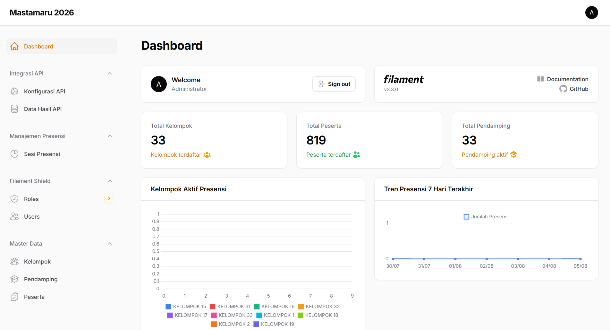
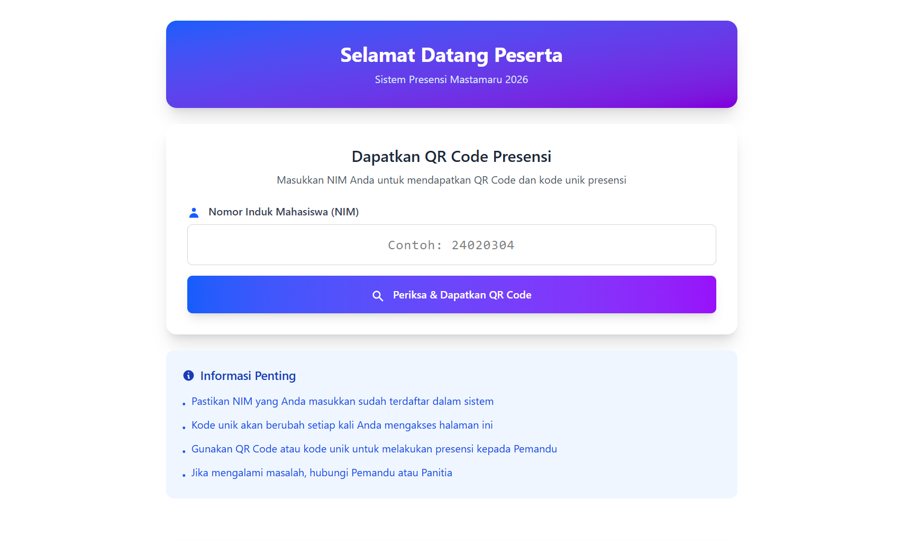
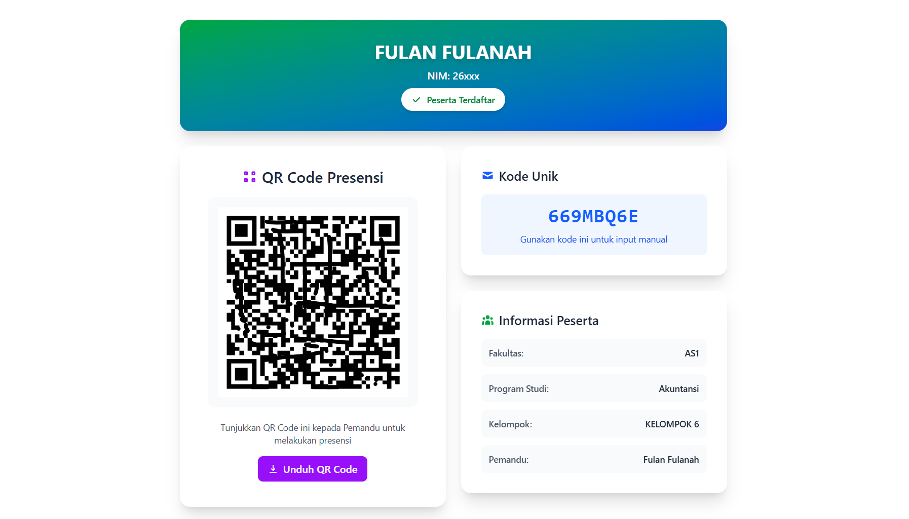

<div align="center">
  
  <h1>🎓 Presensi MASTAMARU UMPO 2026</h1>
  <p>Sistem Presensi Modern untuk kegiatan Masa Ta'aruf Mahasiswa Baru Universitas Muhammadiyah Ponorogo</p>
  
  
  
  
</div>

---

## 🌟 Fitur Unggulan

- 🛡️ **Admin Panel Dinamis**: Antarmuka responsif yang dibangun dengan Filament v3, dilengkapi dengan sistem *Role & Permission* (Filament Shield).
- 🔗 **Integrasi API Pintar (Smart Sync)**: 
  - Mendukung pemetaan dinamis (*dynamic mapping*) dari API pihak ketiga.
  - **Tarik Mahasiswa Aktif UMPO**: Fitur eksklusif satu-klik untuk menyedot ribuan data mahasiswa aktif dan otomatis menerjemahkan kode Fakultas/Jurusan menjadi teks aslinya!
- 🎲 **Distribusi Kelompok Otomatis**: Fitur "Bagi Kelompok Acak" yang mendistribusikan ratusan peserta secara rata dan adil ke semua pendamping.
- 📱 **QR Code / Barcode Presensi**: Mendukung pembuatan kode unik (*generate barcode*) untuk mempermudah alur absensi.
- 📊 **Manajemen Master Data**: Pengelolaan Peserta, Pendamping (mendukung *multi-mentor*), dan Kelompok.
- 📥 **Import & Export Excel**: Manajemen data raksasa menjadi mudah dengan *template spreadsheet*.

---

## 📸 Cuplikan Layar (Screenshots)

### 1. Dashboard Admin Panel
Beranda utama yang bersih dan elegan untuk memantau status presensi dan mengelola aplikasi.


### 2. Generate Barcode & Presensi
Fitur pembuatan barcode/QR untuk setiap peserta guna mempercepat antrean presensi.


### 3. Informasi Detail Presensi
Laporan komprehensif mengenai riwayat dan detail kehadiran mahasiswa.


---

## 🚀 Panduan Instalasi (Local Development)

Ikuti langkah-langkah berikut untuk menjalankan proyek ini di mesin lokal Anda:

### Persyaratan Sistem
- **PHP** >= 8.2
- **Composer** (Package Manager)
- **Node.js & NPM**
- **MySQL / MariaDB**

### Langkah Instalasi

```bash
# 1. Clone Repositori
git clone https://github.com/irhamkaraman/mastamaru-umpo.git
cd mastamaru-umpo

# 2. Install Dependensi PHP
composer install

# 3. Setup File Environment
cp .env.example .env
php artisan key:generate

# 4. Konfigurasi Database
# Buka file .env dan ubah pengaturan DB_DATABASE, DB_USERNAME, dan DB_PASSWORD sesuai dengan server lokal Anda.

# 5. Jalankan Migrasi Data
php artisan migrate --seed

# 6. Install Dependensi Frontend
npm install
npm run build

# 7. Jalankan Server
php artisan serve
```

### Akses Aplikasi
Buka browser Anda dan kunjungi:
- **URL**: `http://localhost:8000/admin`
- **Email**: `admin@admin.com` *(Atau kredensial lain sesuai seeder Anda)*
- **Password**: `password`

---

## 🛠️ Catatan Penting & Troubleshooting

### 1. Hak Akses (Role & Permission) Tidak Muncul?
Jika Anda baru saja menarik (*pull*) kode terbaru dari GitHub atau jika ada penambahan menu/Resource baru (seperti modul Integrasi API), menu tersebut mungkin **disembunyikan** karena akun Anda belum diberi hak akses (*permission*) untuk menu baru tersebut.

Untuk meng-generate ulang seluruh *permission* sistem secara otomatis (menggunakan *Filament Shield*), jalankan perintah berikut di terminal:

```bash
php artisan shield:generate --all
```

Setelah perintah sukses dijalankan:
1. Login ke Dashboard Admin.
2. Buka menu **Roles** (di bawah kategori Filament Shield).
3. Edit role `super_admin` atau role lainnya, lalu pastikan hak akses untuk resource yang baru telah dicentang (Select All).
4. Simpan, dan menu baru akan langsung muncul!

---

## 👨‍💻 Pengembang
- **Irham Karaman** 

*Dibuat dengan ❤️ untuk Universitas Muhammadiyah Ponorogo.*
